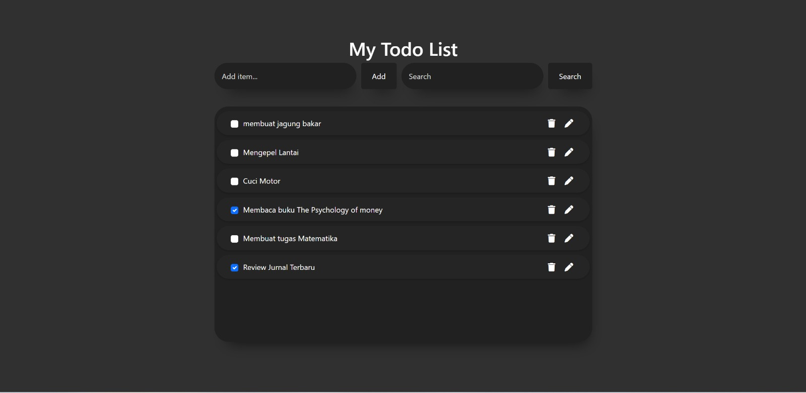

## About the Application
The Todo-list application is a simple, intuitive, and responsive tool designed to help users manage their daily tasks. Built with modern web technologies and styled with Bootstrap and FontAwesome, it provides a sleek and user-friendly interface to efficiently add, edit, and delete tasks.

## Features
- **Add New Todo:** Add new Todo details.
- **Edit Todo :** Modify existing Todo.
- **Delete Todo:** Remove Todo entries from the list.

## Getting Started
### Prerequisites
Before getting started, make sure you have met the following requirements:

- Node.js is installed on your computer.
- PostgreSQL database is configured and running. Update the database configuration in `backend knexfile.js` if necessary.
  you can see my knexfile.js for see my data base and you can change
- if you "change" data base don't forget to running migrations and seed

## How to Run Migration and Seed
  1. first running migration: npx knex migrate:latest
  2. second running Seed : npx knex seed:run

## Instalation 
Terminal Bash:
   1. git clone https://github.com/yrdikaa/2300965_36_Muh_Todolist_Gold
   2. cd Gold-Project
   3. cd backend
   4. npm install

## Usage Server
1. Frontend: 
* Server: Utilizing 'serve' to run the frontend application.
- How to Start : Npm run Start 
You should see the frontend application running at the provided address, typically http://localhost:3000.
2. Backend: 
* Node.JS
- How to Start : Npm Start 
You should see the frontend application running at the provided address, typically http://localhost:5500.

## API Endpoints
The following API endpoints are available:\
  1. GET /api/v1/all: Get a list of all Todos.
  2. POST /api/v1/new: Create a new Todo.
  3. PUT /api/v1/update/:id: Update a Todo by ID.
  4. DELETE /api/v1/delete/:id: Delete a Todo by ID.
You can use these endpoints to interact with the Todo data.

## Postman Documenter
https://documenter.getpostman.com/view/28279095/2s9YC1Wu8f